# Basic description of Binance

**Product essence:** a platform for trading crypto assets, custody, transfers, yield products (earn, staking), token launches, and Web3 access (wallet and adjacent services).

## Subsystems

- **Identity & Access:** account, 2FA, sessions, Know Your Customer pipeline (data collection, verification, risk and policy control, account reviews).
- **Wallet & Ledger:** balances, deposits/withdrawals, internal transfers.
- **Trading Engine:** order books, matching, market types (spot/futures, etc.).
- **Payments:** currency-to-crypto, P2P, card gateways (region-dependent).
- **Risk & Fraud:** limits, blocks, anomaly monitoring.
- **Notifications:** email/push/in-app.
- **Support & Compliance:** tickets, appeals, reporting.

# Site map

**Palette:** 
- Green / amber / orange — Non-Auth flow. 
- Blue → violet — Authenticated flow

```mermaid
flowchart LR
    Home[Home]
    Home --> BuyCrypto[Buy Crypto]
    Home --> Markets[Markets]
    Home --> Trade[Trade]
    Home --> Futures[Futures]
    Home --> Earn[Earn]
    Home --> Square[Square]
    Home --> More[More]

    BuyCrypto --> BuyCryptoBuySell["Buy & Sell"]
    BuyCrypto --> BuyCryptoDeposit[Deposit]
    BuyCrypto --> BuyCryptoWithdraw[Withdraw]

    Markets --> MarketsOverview[Overview]
    Markets --> MarketsTradingData[Trading Data]
    Markets --> MarketsAiSelect[AI Select]
    Markets --> MarketsTokenUnlock[Token Unlock]

    subgraph MarketsOverviewInnerTabs["Overview tabs"]
        direction LR
        MarketsOverviewFavorites[Favorites]
        MarketsOverviewCryptosDefault["Cryptos (default)"]
        MarketsOverviewSpot[Spot]
        MarketsOverviewFeatures[Features]
        MarketsOverviewAlpha[Alpha]
        MarketsOverviewNew[New]
        MarketsOverviewZones[Zones]
    end
    MarketsOverview --> MarketsOverviewFavorites
    MarketsOverview --> MarketsOverviewCryptosDefault
    MarketsOverview --> MarketsOverviewSpot
    MarketsOverview --> MarketsOverviewFeatures
    MarketsOverview --> MarketsOverviewAlpha
    MarketsOverview --> MarketsOverviewNew
    MarketsOverview --> MarketsOverviewZones

    subgraph TradeBasicSemantic["Basic — semantic group"]
        direction TB
        TradeBasicSpot[Spot]
        TradeBasicMargin[Margin]
        TradeBasicP2p[P2P]
        TradeBasicConvertBlockTrade[Convert & Block Trade]
        TradeBasicDemoTrading[Demo Trading]
    end

    subgraph TradeAdvancedSemantic["Advanced — semantic group"]
        direction TB
        TradeAdvancedDexBeta["DEX (Beta)"]
        TradeAdvancedAlpha[Alpha]
        TradeAdvancedTradingBots[Trading Bots]
        TradeAdvancedCopyTrading[Copy Trading]
        TradeAdvancedApis[APIs]
    end

    Trade --> TradeBasicSpot
    Trade --> TradeBasicMargin
    Trade --> TradeBasicP2p
    Trade --> TradeBasicConvertBlockTrade
    Trade --> TradeBasicDemoTrading
    Trade --> TradeAdvancedDexBeta
    Trade --> TradeAdvancedAlpha
    Trade --> TradeAdvancedTradingBots
    Trade --> TradeAdvancedCopyTrading
    Trade --> TradeAdvancedApis

    Futures --> FuturesUsdMargined[USDⓈ-M Futures]
    Futures --> FuturesCoinMargined[COIN-M Futures]
    Futures --> FuturesOptions[Options]

    Earn --> EarnOverview[Overview]
    Earn --> EarnSimpleEarn[Simple Earn]
    Earn --> EarnAdvancedEarn[Advanced Earn]
    Earn --> EarnLoans[Loans]

    Square --> SquareContent[Square]
    Square --> SquareBlog[Blog]
    Square --> SquareResearch[Research]

    More --> MoreVipInstitutional["VIP & Institutional"]
    More --> MoreAffiliate[Affiliate]
    More --> MoreReferral[Referral]
    More --> MoreBinanceJunior["Binance Junior"]
    More --> MoreLaunchpool[Launchpool]
    More --> MoreMegadrop[Megadrop]
    More --> MoreMiningPool["Mining Pool"]
    More --> MorePay[Pay]
    More --> MoreNft[NFT]
    More --> MoreFanToken["Fan Token"]
    More --> MoreBinanceWallet["Binance Wallet"]
    More --> MoreBnbChain["BNB Chain"]
    More --> MoreBinanceAcademy["Binance Academy"]
    More --> MoreCharity[Charity]
    More --> MoreTravelRule["Travel Rule"]
    Home --> Cabinet[Cabinet]
    Home --> Messages[Messages]
    Cabinet --> CabinetDashboard[Dashboard]
    Cabinet --> CabinetAssetsWallet["Assets(Wallet)"]
    subgraph WalletTabs["Wallet tabs"]
        direction LR
        WalletTabOverview[Overview]
        WalletTabSpot[Spot]
        WalletTabMargin[Margin]
        WalletTabFutures[Futures]
        WalletTabOptions[Options]
        WalletTabTradingBots["Trading Bots"]
        WalletTabEarn[Earn]
        WalletTabFunding[Funding]
        WalletTabVerification[Verification]
        WalletTabThirdParty["Third-party"]
    end
    CabinetAssetsWallet --> WalletTabOverview
    CabinetAssetsWallet --> WalletTabSpot
    CabinetAssetsWallet --> WalletTabMargin
    CabinetAssetsWallet --> WalletTabFutures
    CabinetAssetsWallet --> WalletTabOptions
    CabinetAssetsWallet --> WalletTabTradingBots
    CabinetAssetsWallet --> WalletTabEarn
    CabinetAssetsWallet --> WalletTabFunding
    CabinetAssetsWallet --> WalletTabVerification
    CabinetAssetsWallet --> WalletTabThirdParty
    Cabinet --> CabinetOrders[Orders]
    subgraph OrdersSections["Orders sections"]
        direction LR
        OrdersSectionAssetHistory["Asset History"]
        OrdersSectionSpotOrder["Spot Order"]
        OrdersSectionP2pOrder["P2P Order"]
    end
    CabinetOrders --> OrdersSectionAssetHistory
    CabinetOrders --> OrdersSectionSpotOrder
    CabinetOrders --> OrdersSectionP2pOrder
    Cabinet --> CabinetRewardsHub["Rewards Hub"]
    Cabinet --> CabinetReferral[Referral]
    Cabinet --> CabinetAccount[Account]
    subgraph AccountSections["Account sections"]
        direction LR
        AccountIdentification[Identification]
        AccountSecurity[Security]
        AccountPayment[Payment]
        AccountApiManagement["API Management"]
        AccountStatement["Account Statement"]
        AccountFinancialReport["Financial Report"]
    end
    CabinetAccount --> AccountIdentification
    CabinetAccount --> AccountSecurity
    CabinetAccount --> AccountPayment
    CabinetAccount --> AccountApiManagement
    CabinetAccount --> AccountStatement
    CabinetAccount --> AccountFinancialReport
    Cabinet --> CabinetSubAccounts["Sub Accounts"]
    Cabinet --> CabinetSettings[Settings]

    subgraph MessagesHub["Messages hub"]
        direction LR
        MessagesChat[Chat]
        MessagesAnnouncement[Announcement]
        MessagesCampaign[Campaign]
        MessagesMarketingActivities["Marketing & Activities"]
    end
    Messages --> MessagesChat
    Messages --> MessagesAnnouncement
    Messages --> MessagesCampaign
    Messages --> MessagesMarketingActivities

    classDef depth0 fill:#14532d,stroke:#052e16,color:#fff
    classDef depth1 fill:#16a34a,stroke:#14532d,color:#fff
    classDef depth2 fill:#facc15,stroke:#ca8a04,color:#422006
    classDef depth3 fill:#fb923c,stroke:#ea580c,color:#431407
    classDef depth1-auth fill:#3b82f6,stroke:#1d4ed8,color:#fff
    classDef depth2-auth fill:#8b5cf6,stroke:#5b21b6,color:#fff
    classDef depth3-auth fill:#c4b5fd,stroke:#6d28d9,color:#1e1b4b
    class Home depth0
    class Cabinet,Messages depth1-auth
    class CabinetDashboard,CabinetAssetsWallet,CabinetOrders,CabinetRewardsHub,CabinetReferral,CabinetAccount,CabinetSubAccounts,CabinetSettings,MessagesChat,MessagesAnnouncement,MessagesCampaign,MessagesMarketingActivities,MessagesAccount depth2-auth
    class WalletTabOverview,WalletTabSpot,WalletTabMargin,WalletTabFutures,WalletTabOptions,WalletTabTradingBots,WalletTabEarn,WalletTabFunding,WalletTabVerification,WalletTabThirdParty,OrdersSectionAssetHistory,OrdersSectionSpotOrder,OrdersSectionP2pOrder,AccountIdentification,AccountSecurity,AccountPayment,AccountApiManagement,AccountStatement,AccountFinancialReport depth3-auth
    class BuyCrypto,Markets,Trade,Futures,Earn,Square,More depth1
    class BuyCryptoBuySell,BuyCryptoDeposit,BuyCryptoWithdraw,MarketsOverview,MarketsTradingData,MarketsAiSelect,MarketsTokenUnlock,TradeBasicSpot,TradeBasicMargin,TradeBasicP2p,TradeBasicConvertBlockTrade,TradeBasicDemoTrading,TradeAdvancedDexBeta,TradeAdvancedAlpha,TradeAdvancedTradingBots,TradeAdvancedCopyTrading,TradeAdvancedApis,FuturesUsdMargined,FuturesCoinMargined,FuturesOptions,EarnOverview,EarnSimpleEarn,EarnAdvancedEarn,EarnLoans,SquareContent,SquareBlog,SquareResearch,MoreVipInstitutional,MoreAffiliate,MoreReferral,MoreBinanceJunior,MoreLaunchpool,MoreMegadrop,MoreMiningPool,MorePay,MoreNft,MoreFanToken,MoreBinanceWallet,MoreBnbChain,MoreBinanceAcademy,MoreCharity,MoreTravelRule depth2
    class MarketsOverviewFavorites,MarketsOverviewCryptosDefault,MarketsOverviewSpot,MarketsOverviewFeatures,MarketsOverviewAlpha,MarketsOverviewNew,MarketsOverviewZones depth3
```

---

### Buy Crypto menu (reference copy)

| Item | Description |
|------|-------------|
| Buy & Sell | Buy or sell crypto with fiat and supported payment rails; example path pattern [binance.com/en/crypto/buy/USD/BTC](https://www.binance.com/en/crypto/buy/USD/BTC). |
| Deposit | Move crypto (or eligible fiat) into your Binance wallets. |
| Withdraw | Send crypto from Binance to external wallets or allowed off-ramps. |

---

### Markets menu (reference copy)

| Item | Description |
|------|-------------|
| Overview | Main market discovery area; uses the **Overview tabs** in the table below. |
| Trading Data | Data-heavy market views (movements, stats, and related tooling; labels vary). |
| AI Select | AI-assisted or curated market highlights (scope depends on product). |
| Token Unlock | Token unlock schedules, mechanics, or related market content (product-specific). |

---

### Markets — Overview tabs

Under **Markets → Overview**, the UI uses these tabs (**Cryptos** is the default).

| Tab | Short description |
|-----|-------------------|
| Favorites | Saved or watchlisted pairs for quick access. |
| Cryptos | Main crypto market list, sorting, and filters (**default tab**). |
| Spot | Spot markets and related metrics in one view. |
| Features | Curated highlights, themes, or featured listings. |
| Alpha | Early-stage, Web3, or experimental market segments. |
| New | Recently listed tokens and new trading pairs. |
| Zones | Thematic, regional, or campaign-based market groupings (where offered). |

---

### Trade menu (reference copy)

**Basic**

| Item | Description |
|------|-------------|
| Spot | Buy and sell on the Spot market with advanced tools |
| Margin | Increase your profits with leverage |
| P2P | Buy & sell cryptocurrencies using bank transfer and 800+ options |
| Convert & Block Trade | The easiest way to trade at all sizes |
| Demo Trading | Use virtual funds to experience real trading scenarios with zero risk. |

**Advanced**

| Item | Description |
|------|-------------|
| DEX (Beta) | On-chain trading with Binance Wallet |
| Alpha | Quick access to Web3 via Alpha Trading |
| Trading Bots | Trade smarter with our various automated strategies - easy, fast and reliable |
| Copy Trading | Follow the most popular traders |
| APIs | Unlimited opportunities with one key |

---

### Earn menu (reference copy)

| Item | Description |
|------|-------------|
| Overview | One-stop portal for all Earn products |
| Simple Earn | Earn passive income on 300+ crypto assets with flexible and locked terms |
| Advanced Earn | Maximize your returns with our advanced yield investment products |
| Loans | Access quick and easy loans with competitive rates |

---

### Square menu (reference copy)

| Item | Description |
|------|-------------|
| Square | Stay informed with everything crypto |
| Blog | Expand your knowledge and get the latest insights |
| Research | Institutional-grade analysis, in-depth insights, and more |

---

### More menu (reference copy)

| Item | Description |
|------|-------------|
| VIP & Institutional | Your trusted digital asset platform for VIPs and institutions |
| Affiliate | Earn up to 50% commission per trade from referrals |
| Referral | Invite friends to earn either a commission rebate or a one-time reward |
| Binance Junior | A parent-supervised crypto account for kids and teens |
| Launchpool | Discover and gain access to new token launches |
| Megadrop | Lock your BNB and complete Web3 quests for boosted airdrop rewards |
| Mining Pool | Mine more rewards by connecting to the pool |
| Pay | Send, receive and spend crypto |
| NFT | Explore NFTs from creators worldwide |
| Fan Token | Discover an all-new fandom and unlock unlimited fan experiences |
| Binance Wallet | Access and Navigate Web3 Effortlessly |
| BNB Chain | The most popular blockchain to build your own dApp |
| Binance Academy | Free crypto & blockchain education |
| Charity | Blockchain empowers charity to be more transparent, efficient, and traceable |
| Travel Rule | Enhance transparency and combat financial crimes such as money laundering and terrorism financing |

---

### Cabinet page (reference copy)

Signed-in **Cabinet** hub: primary account navigation as observed in-product (labels may vary by locale or app shell).

| Item | Description |
|------|-------------|
| Dashboard | Signed-in home: portfolio snapshot, shortcuts, and high-level status widgets. |
| Assets | Wallet hub: tabbed balances and history; see **Assets / Wallet tabs** for the ordered list. |
| Orders | Open orders, order history, and trade history across eligible markets. |
| Rewards Hub | Loyalty, missions, vouchers, and rebate or campaign summaries in one place. |
| Referral | Invite links, referee status, and commission or reward tracking for the referral program. |
| Account | Profile and account administration; see **Account — sections** for the ordered list. |
| Sub Accounts | Create and manage sub-accounts for separated trading or operational use. |
| Settings | App and account preferences: notifications, language, display, and related toggles. |

---

### Account — sections (reference copy)

Order and labels as observed in-product under **Cabinet → Account**.

| Section | Description |
|---------|-------------|
| Identification | KYC / identity verification status, documents, and limit-related identity flows. |
| Security | Password, 2FA, devices, anti-phishing, and other account safety controls. |
| Payment | Linked payment methods, pay settings, and fiat or card rails where available. |
| API Management | API key creation, permissions, and usage controls for programmatic access. |
| Account Statement | Official statements and downloadable records for the account (moved from **Assets (Wallet)** in this model). |
| Financial Report | Tax- or reporting-oriented exports and financial summaries (product-specific). |

---

### Assets / Wallet tabs (reference copy)

Order and labels as observed in-product under **Cabinet → Assets (Wallet)**.

| Tab | Description |
|-----|-------------|
| Overview | Aggregate balances and quick status across wallet types. |
| Spot | Balances for spot trading and related transfers. |
| Margin | Cross / isolated margin wallet balances. |
| Futures | USDⓈ-M / COIN-M (and related) futures wallet balances. |
| Options | Options account balance where the product is available. |
| Trading Bots | Balances and allocation tied to trading-bot strategies. |
| Earn | Wallet view for earn / staking positions and related balances. |
| Funding | Funding wallet: P2P, pay rails, and general deposit / withdraw context. |
| Verification | Identity / verification status and flows tied to wallet or account limits. |
| Third-party | External or connected third-party wallet surfaces. |

---

### Messages page (reference copy)

Signed-in **Messages** hub: sections or tabs as observed in-product (labels may vary by locale or app shell).

| Item | Description |
|------|-------------|
| Chat | Live or threaded chat with support or in-product messaging flows tied to the signed-in user. |
| Announcement | Official notices: maintenance, incidents, policy or product announcements. |
| Campaign | Reward campaigns, tasks, airdrop-style programs, and eligibility or progress for active promos. |
| Marketing & Activities | Broader marketing and engagement: events, featured activities, and partner or seasonal pushes. |
---
